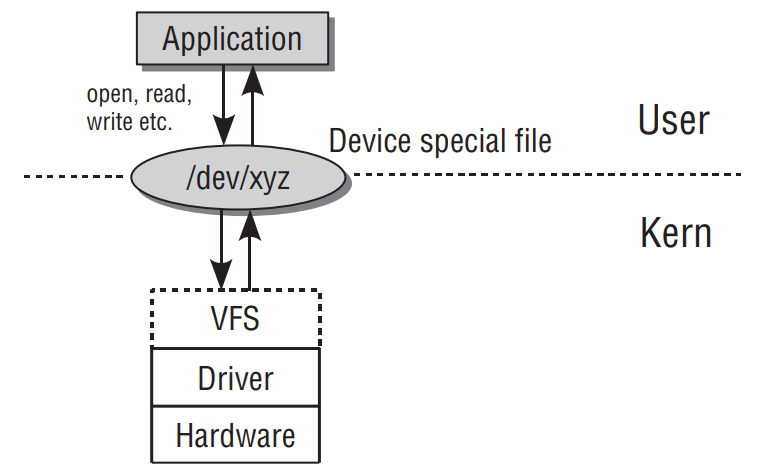

- 实现外围设备交互要解决的三个问题 [[《Professional Linux Kernel Architecture》]]
	- 首先，内核必须能够访问硬件（访问的方式取决于具体设备）。
	- 其次，内核必须提供用户接口和系统工具来访问各种设备。这些提供出来的接口和工具在形式上应尽可能统一，以确保开发人员不需要为不同的硬件方法实现编写大量代码。
	- 最后，用户需要知道内核中有哪些可以使用的设备。
- Linux系统访问外围设备的层级框图 [[《Professional Linux Kernel Architecture》]]
	- 
-